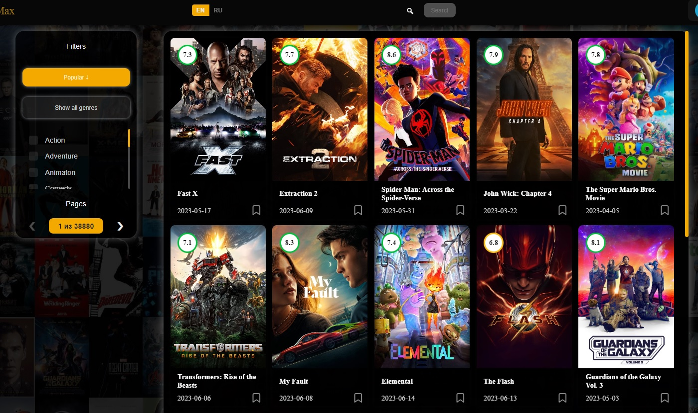
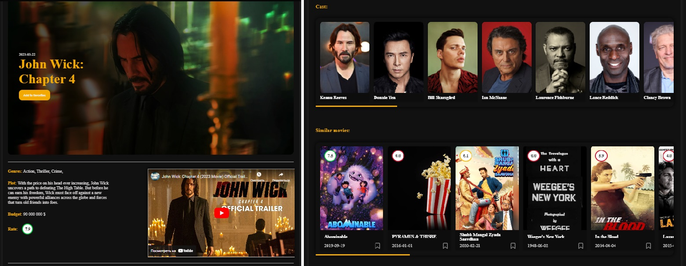
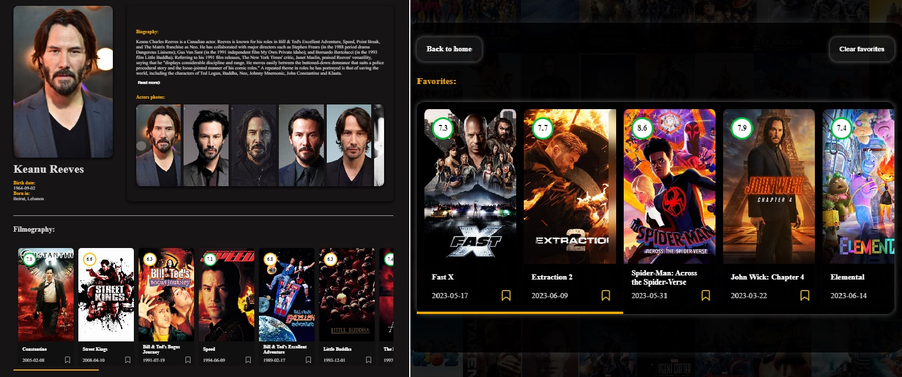

### Movie App

[DemoLink](https://react-movie-app-alpha-six.vercel.app/)

---
## If you from Belarus or Russia, app will works only with VPN!!!

## Description
This is a project to search and view information about movies
 
 
## Functional

- user registration
- movies filters and sorting
- movie search
- selected movie page (movie info, trailer, cast, list of similar movies)
- actor page (information about the actor, gallery of photos, filmography )
- language change
- ability to add movies to favorites

 

 

### :hammer_and_wrench: Languages and Tools :

  &nbsp;
  &nbsp;
  &nbsp;

